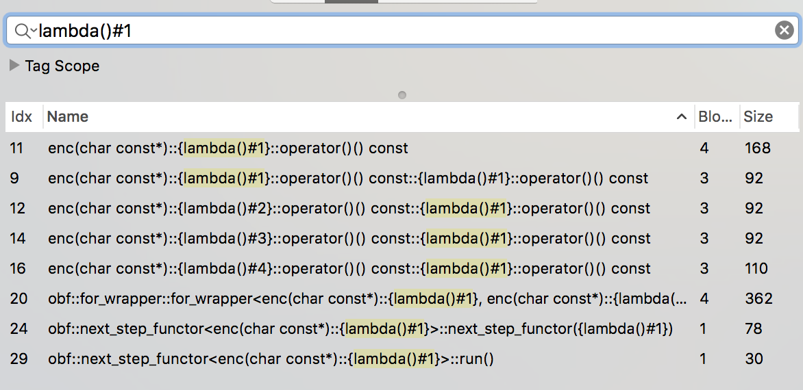

# Obfuscaxor
Reversing

## Challenge 

nc rev.tamuctf.com 7224

Difficulty: hard

[obfuscaxor](obfuscaxor)

## Solution

### Reverse Engineer: Obfuscator Library

If we were to do a simple strings on the binary file, we see lots of function names such as 

	next_step_functor_base

Doing some searching, we found the C++ Obfuscating framework used.

> [fritzone/obfy](https://github.com/fritzone/obfy)

Look through the documentations to understand how it works.

### Reverse Engineer: Static Values

Let's first reverse the "Value and numerical wrappers" of the ofby library

See lots of obfuscated values in the `verify_key(&var_90)` function

    rax = obf::Num<int, 3858>::Num();
    rdi = &var_60;
    *(int8_t *)var_B0 = obf::Num<int, 3858>::get() ^ 0xffffffcc;
    rdi = &var_60;
    rax = obf::Num<int, 2568>::Num();
    rdi = &var_60;
    *(int8_t *)(var_B0 + 0x1) = obf::Num<int, 2568>::get() ^ 0xffffffa5;
    rdi = &var_60;
    rax = obf::Num<int, 1868>::Num();
    rdi = &var_60;
    *(int8_t *)(var_B0 + 0x2) = obf::Num<int, 1868>::get() ^ 0xfffffff2;
    rdi = &var_60;
    rax = obf::Num<int, 749>::Num();
    rdi = &var_60;
    *(int8_t *)(var_B0 + 0x3) = obf::Num<int, 749>::get() ^ 0x2;
    rdi = &var_60;
    rax = obf::Num<int, 1056>::Num();
    rdi = &var_60;
    *(int8_t *)(var_B0 + 0x4) = obf::Num<int, 1056>::get() ^ 0x20;

By doing the XORs, we get the following as our reverse engineered values

    var_B0[0] = LO_BYTE(0xfffff0de); // == 0xde
    var_B0[1] = LO_BYTE(0xfffff5ad); // == 0xad
    var_B0[2] = LO_BYTE(0xfffff8be); // == 0xbe
    var_B0[3] = LO_BYTE(0x2ef);      // == 0xef
    var_B0[4] = LO_BYTE(0x400);      // == 0x00

    // var_B0[0:4] == bytes.fromhex('deadbeef00')

---

### Reverse Engineer: For-Loop

#### Understanding Control Structures

Now we see some "Control structures" of ofby at the end of the function `verify_key(&var_90)`.

    rax = obf::for_wrapper::for_wrapper<enc(&var_80, &var_BC, &var_C4); // var_C4 == 0x03
    stack[2015] = &var_C4;
    stack[2014] = &var_B0;
    stack[2013] = &var_D8;
    stack[2012] = &var_BC;
    stack[2011] = &var_B8;
    rsp = ((rsp - 0x10) + 0x10 - 0x30) + 0x30;
    rdi = obf::for_wrapper& obf::for_wrapper::set_body<enc(&var_80);
    rax = obf::for_wrapper::run();
    rdi = &var_80;
    rax = obf::for_wrapper::~for_wrapper();
    rdi = &var_90;
    rax = std::shared_ptr<obf::base_rvholder>::~shared_ptr();
    rbx = operator new(0x18);
    rdx = var_B8;
    rax = obf::rvholder<char*>::rvholder(rbx, var_B8);
    rsi = rbx;
    rax = std::enable_if<std::__sp_is_constructible<obf::base_rvholder, obf::rvholder<char*> >::value, void>::type std::__shared_ptr<obf::base_rvholder, (&var_A0);
    rbx = __cxa_allocate_exception(0x10);
    rsi = &var_A0;
    rax = std::shared_ptr<obf::base_rvholder>::shared_ptr(rbx);
    rax = __cxa_throw(rbx, typeinfo for std::shared_ptr<obf::base_rvholder>, std::shared_ptr<obf::base_rvholder>::~shared_ptr());
    return rax;

According to the [obfy documenntations](https://github.com/fritzone/obfy/blob/master/instr.h), this is a for-loop (for_wrapper).

	// https://github.com/fritzone/obfy/blob/master/instr.h#L341

    explicit for_wrapper(INIT lambda_init, COND lambda_cond, INCR lambda_incr)
    {
        condition.reset(new bool_functor<COND>(lambda_cond));
        initializer.reset(new next_step_functor<INIT>(lambda_init));
        increment.reset(new next_step_functor<INCR>(lambda_incr));
    }

And the relevant macro in the library

	// https://github.com/fritzone/obfy/blob/master/instr.h#L790

	#define FOR(init,cond,inc) { std::shared_ptr<obf::base_rvholder> __rvlocal; obf::for_wrapper( [&](){(init); return __crv; },\
	           [&]()->bool{return (cond); }, \
	           [&](){inc;return __crv;}).set_body( [&]() {
	#define ENDFOR return __crv;}).run(); }

---

#### Apply to decompiled code

Looking at the ofby macro, we can extract the decompiled code and make some guesses.

	obf::for_wrapper::for_wrapper<enc(&var_80, &var_BC, &var_C4); // var_C4 == 0x03

Unfortunately, the decompiled code is not sufficient to guess what it does. Let's look at the assembly

	00001e75         mov        rdx, r13                                    ; argument #3 for method _ZN3obf11for_wrapperC2IZ3encPKcEUlvE_Z3encS3_EUlvE0_Z3encS3_EUlvE1_EET_T0_T1_
	00001e78         mov        rsi, rcx                                    ; argument #2 for method _ZN3obf11for_wrapperC2IZ3encPKcEUlvE_Z3encS3_EUlvE0_Z3encS3_EUlvE1_EET_T0_T1_
	00001e7b         lea        rax, qword [rbp+var_80]
	00001e7f         push       qword [rbp+var_E8]
	00001e85         push       qword [rbp+var_F0]
	00001e8b         mov        rcx, rdi
	00001e8e         mov        rdi, rax                                    ; argument #1 for method _ZN3obf11for_wrapperC2IZ3encPKcEUlvE_Z3encS3_EUlvE0_Z3encS3_EUlvE1_EET_T0_T1_
	00001e91         call       _ZN3obf11for_wrapperC2IZ3encPKcEUlvE_Z3encS3_EUlvE0_Z3encS3_EUlvE1_EET_T0_T1_ ; obf::for_wrapper::for_wrapper<enc(char const*)::{lambda()#1}, enc(char const*)::{lambda()#2}, enc(char const*)::{lambda()#3}>(enc(char const*)::{lambda()#1}, enc(char const*)::{lambda()#2}, enc(char const*)::{lambda()#3}), Begin of try block (catch block at 0x1f98)
	00001e96         add        rsp, 0x10                                   ; End of try block started at 0x1e91

Look at line `00001e91`, read the added comments by Hopper disassembler to the right.

We find out that it is calling some lambda functions with the following parameters.

	// FOR(init,cond,inc) {
	//     body
	// END_FOR
	
	init = enc(char const*)::{lambda()#1}
	cond = enc(char const*)::{lambda()#3}
	inc  = enc(char const*)::{lambda()#3}
	body = enc(char const*)::{lambda()#4}

Do a search in the function names of `{lambda()#1}`. The first 2 are what we are looking for..

Do the same for `{lambda()#2}`, `{lambda()#3}` and `{lambda()#4}`

I extracted them out in a file...

> [for-loop.c](for-loop.c)

---

#### Reverse decompiled code

Let's do a reverse of logic for the for-loop. In essence, this initialises the value at `x = 0`.

	for_loop_init_lamda() {
		/* Reverse this by doing the XOR function */
		// var_2C = LODWORD(LODWORD(obf::Num<int, 2520>::get()) ^ 0x9d8);
		var_2C = 0x00;

		/* Decompile extra_addition and we find out it is just
		 * adding and subtracting the same number */
		// rax = enc();
		inline function enc(var_30) {
			// obf::extra_addition<int>::extra_addition(&var_30);
			// obf::extra_addition<int>::~extra_addition(&var_30);
			return var_30 + 0xb1 - 0xb1;
		}
		enc();

		// var_28 = *var_38;
		// var_20 = obf::refholder<int> obf::operator<< <int>(*var_38, rsi);
		// rax = obf::refholder<int>::operator=(&var_20);
		// return rax;
		return x = 0; // var_20 = var_2C ==0
	}

When referring to the [ofby code](https://github.com/fritzone/obfy/blob/master/instr.h), the pattern becomes apparent.

I identify that in order to reverse engineer, we must look for the following...

1. Look for the LHS and RHS
	- in this case, RHS is a constant at `var_2C = 0x00`
	- LHS is the return value
2. Ignore `extra_addition()` as it is to confuse us
3. Look for the `operatorX` where X is the operator (`+-*/<>`, etc.)

With our understanding, let's do the others

	// {lambda()#2}
	for_loop_cond_lamda() {
		// var_2C = LODWORD(LODWORD(*(int32_t *)*(var_38 + 0x8)) - 0x1);
		// var_28 = *var_38;
		// var_20 = obf::refholder<int> obf::operator<< <int>(*var_38, rsi);
		// rax = obf::refholder<int>::operator<(&var_20);

		return x < var_2C - 1;
	}

	// {lambda()#3}
	for_loop_inc_lamda() {
		return x += 1;
	}

#### Reverse the body code ({lambda()#4})

And the body is really long, but if you look carefully, it simply does an XOR of some sort...

	// enc(char const*)::{lambda()#4}::operator()() const
	int _ZZ3encPKcENKUlvE2_clEv() {
	    // ...
	    var_70 = obf::refholder<char const> obf::operator<< <char const>(sign_extend_32(*(int32_t *)*(var_88 + 0x8)) + **(var_88 + 0x10), rsi);
	    rdi = &var_70;
	    rbx = obf::refholder<char const>::operator char const();
	    // ...
	    var_68 = obf::refholder<char> obf::operator<< <char>(sign_extend_32((*(int32_t *)*(var_88 + 0x8) + (rdx >> 0x1e) & 0x3) - (rdx >> 0x1e)) + **(var_88 + 0x18), rsi);
	    rdi = &var_68;
	    var_79 = obf::refholder<char>::operator char() ^ rbx;
	    // ...
	    var_78 = obf::refholder<char> obf::operator<< <char>(sign_extend_32(*(int32_t *)*(var_88 + 0x8)) + **var_88, rsi);
	    rsi = &var_79;
	    rax = obf::refholder<char>::operator=(&var_78);
	    // ...
	}

---

#### Working operation of for-loop

So we are left with wondering what is `var_2C` and the body code.

	init: x = 0
	cond: x < var_2C - 1
	incr: x += 1
	body: XOR operation?

Remember that in the `enc() / _Z3encPKc()` function ([decompile.c](decompile.c)), here is a strlen being used here...

    var_B8 = malloc(0x40);
    var_C0 = strlen(var_D8);
    var_B0 = malloc(0x5);

If we were to intelligently guess, the for-loop iterates through from `index = 0`to index = `str_len - 1`

	for (x = 0; x < strlen-1; x++) {
		BODY
	}

The for-loop basically iterates from `index = 0` to `index = var_38 - 1`.

Another guess is that the XOR is using the key of `deadbeef00` that we got from the static values.

---

In `verify_key()`, we compare the encrypted value to a string in memory 0x3c00.

	// verify_key(&var_90)
	int _Z10verify_keyPc(int * arg0) {
	    var_18 = arg0;
	    if ((strlen(var_18) > 0x9) && (strlen(var_18) <= 0x40)) {
	            rax = enc(var_18);
	            rax = strcmp(0x3c00, rax);
	            rax = rax == 0x0 ? 0x1 : 0x0;
	    }
	    else {
	            rax = 0x0;
	    }
	    return rax;
	}

So now I extract out the encrypted data

	// strcmp(0x3c00, rax); -> 16 chats
	0000000000003c00         db  0xae ; '.'                                         ; DATA XREF=_Z10verify_keyPc+71
	0000000000003c01         db  0x9e ; '.'
	0000000000003c02         db  0xff ; '.'
	0000000000003c03         db  0x9c ; '.'
	0000000000003c04         db  0xab ; '.'
	0000000000003c05         db  0xc7 ; '.'
	0000000000003c06         db  0xd3 ; '.'
	0000000000003c07         db  0x81 ; '.'
	0000000000003c08         db  0xe7 ; '.'
	0000000000003c09         db  0xee ; '.'
	0000000000003c0a         db  0xfb ; '.'
	0000000000003c0b         db  0x8a ; '.'
	0000000000003c0c         db  0x9d ; '.'
	0000000000003c0d         db  0xef ; '.'
	0000000000003c0e         db  0x8d ; '.'
	0000000000003c0f         db  0xae ; '.'
	0000000000003c10         db  0x00 ; '.'
	0000000000003c11         db  0x00 ; '.'

### Solving

Write some python code and we can do an XOR of these

	encrypted = bytes([0xae, 0x9e, 0xff, 0x9c, 0xab, 0xc7, 0xd3, 0x81, 0xe7, 0xee, 0xfb, 0x8a, 0x9d, 0xef, 0x8d, 0xae])
	key = bytes.fromhex('deadbeef')
	decrypted = xor(encrypted, cycle(key))

Runnning the code, we get the values

	$ python3 solve.py 
	encrypted b'\xae\x9e\xff\x9c\xab\xc7\xd3\x81\xe7\xee\xfb\x8a\x9d\xef\x8d\xae'
	key b'\xde\xad\xbe\xef'
	decrypted b'p3Asujmn9CEeCB3A'

Try the decrypted text on the server

	$ nc rev.tamuctf.com 7224

	Please Enter a product key to continue: 
	p3Asujmn9CEeCB3A
	gigem{x0r_64d5by}

## Flag

	gigem{x0r_64d5by}

## Appendix

GDB breakpoints

	(gdb) run
	Starting program: /FILES/obfuscaxor 

	Please Enter a product key to continue: 
	[Inferior 1 (process 59885) exited normally]
	(gdb) br _Z3encPKc
	Breakpoint 1 at 0x555555555cb5
	
	(gdb) printf "%lx\n", 0x555555555cb1 - 0x01cb1 + 0x1e00
	555555555e00
	
	(gdb) br *0x555555555e00
	Breakpoint 2 at 0x555555555e00
	
	(gdb) cont
	The program is not being run.

	(gdb) run 
	Starting program: /FILES/obfuscaxor 

	Please Enter a product key to continue: 
	0123456789ABCDEF

