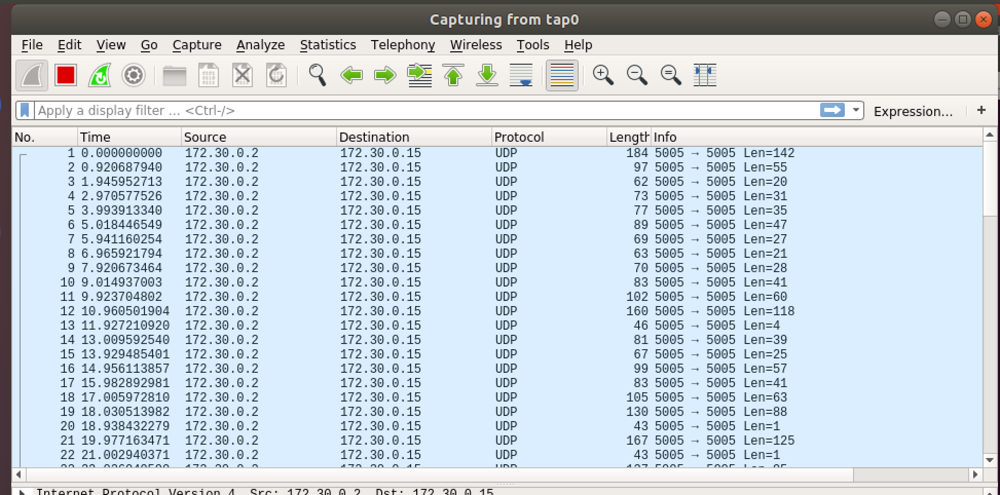

# Stop and Listen
Network/Pentest

## Challenge 

Sometimes you just need to stop and listen.

This challenge is an introduction to our network exploit challenges, which are hosted over OpenVPN.

[Instructions](https://gist.github.com/nategraf/74204dd8b55fb20d29c32ae2bb2ff679):

	Install OpenVPN. Make sure to install the TAP driver.
		Debian (Ubuntu/Kali) linux CLI: apt install openvpn
		Windows GUI installer
	
	Obtain your OpenVPN configuration in the challenge modal.
		You will obtain a separate config for each challenge containing connection info and certificates for authentication.
	
	Launch OpenVPN:
		CLI: sudo openvpn --config ${challenge}.ovpn
		Windows GUI: Place the config file in %HOMEPATH%\OpenVPN\config and right-click the VPN icon on the status bar, then select the config for this challenge

	The virtual tap0 interface will be assigned the IP address 172.30.0.14/28 by default. If multiple team members connect you will need to choose a unique IP for both.

The standard subnet is 172.30.0.0/28, so give that a scan ;)

If you have any issues, please let me (nategraf) know in the Discord chat

Some tools to get started:

	Wireshark
	tcpdump
	nmap
	ettercap
	bettercap

[listen.ovpn](listen.ovpn)

## Solution

#### Setup

Install OpenVPN

	$ sudo apt-get install -y openvpn

Start OpenVPN with the given configuration

	$ sudo openvpn listen.ovpn

Use nmap to scan for hosts
- https://security.stackexchange.com/questions/36198/how-to-find-live-hosts-on-my-network
- https://hackertarget.com/nmap-cheatsheet-a-quick-reference-guide/

#### Scan Hosts

Scan subnet for host discovery

	$ nmap -sP 172.30.0.0/28

	Starting Nmap 7.60 ( https://nmap.org ) at 2019-02-27 12:03 +08
	Nmap scan report for 172.30.0.2
	Host is up (0.31s latency).
	Nmap scan report for zst-VirtualBox (172.30.0.14)
	Host is up (0.000055s latency).
	Nmap done: 16 IP addresses (2 hosts up) scanned in 4.61 seconds

Confirm the IP addresses

	~$ arp -a -n
	? (172.30.0.13) at <incomplete> on tap0
	? (10.0.2.2) at 52:54:00:12:35:02 [ether] on enp0s3
	? (172.30.0.8) at <incomplete> on tap0
	? (172.30.0.9) at <incomplete> on tap0
	? (172.30.0.4) at <incomplete> on tap0
	? (172.30.0.10) at <incomplete> on tap0
	? (172.30.0.5) at <incomplete> on tap0
	? (172.30.0.11) at <incomplete> on tap0
	? (172.30.0.6) at <incomplete> on tap0
	? (172.30.0.7) at <incomplete> on tap0
	? (172.30.0.1) at <incomplete> on tap0
	? (172.30.0.2) at 02:42:28:73:6d:b5 [ether] on tap0
	? (172.30.0.3) at <incomplete> on tap0
	? (172.30.0.12) at <incomplete> on tap0

> Now we know there are 2 hosts, `172.30.0.2` (server) and `172.30.0.14` (myself)

Doing a port scan and service detection give no results

	$ nmap -sV 172.30.0.2

	Starting Nmap 7.60 ( https://nmap.org ) at 2019-02-27 12:02 +08
	Nmap scan report for 172.30.0.2
	Host is up (0.20s latency).
	All 1000 scanned ports on 172.30.0.2 are closed

#### Listen for packets

Hence, referring to the challenge name, we need to listen using Wireshark

With this, we see that the server is sending UDP packets to port 5005.

Let's use NetCat to listen for the incoming connection.

	# -l = listen for an incoming connection 
	# -u = udp connection
	# -k = continue to listen for another connection after its current connection is completed

	$ nc -luk 5005

And we see the message streaming in slowly.

	"You're really not going to like it," observed Deep Thought.
	"Tell us!"
	"All right," said Deep Thought. "The Answer to the Great Question..."
	"Yes..!"
	"Of Life, the Universe and Everything..." said Deep Thought.
	"Yes...!"
	"Is..." said Deep Thought, and paused.
	"Yes...!"
	"Is..."
	"Yes...!!!...?"
	"gigem{f0rty_tw0_c9d950b61ea83}" said Deep Thought, with infinite majesty and calm.” 

## Flag

	gigem{f0rty_tw0_c9d950b61ea83}
